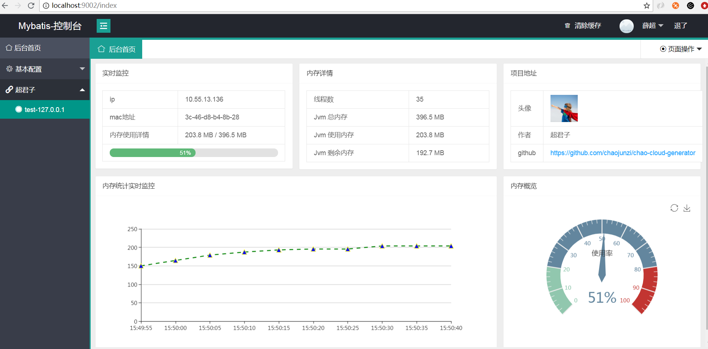
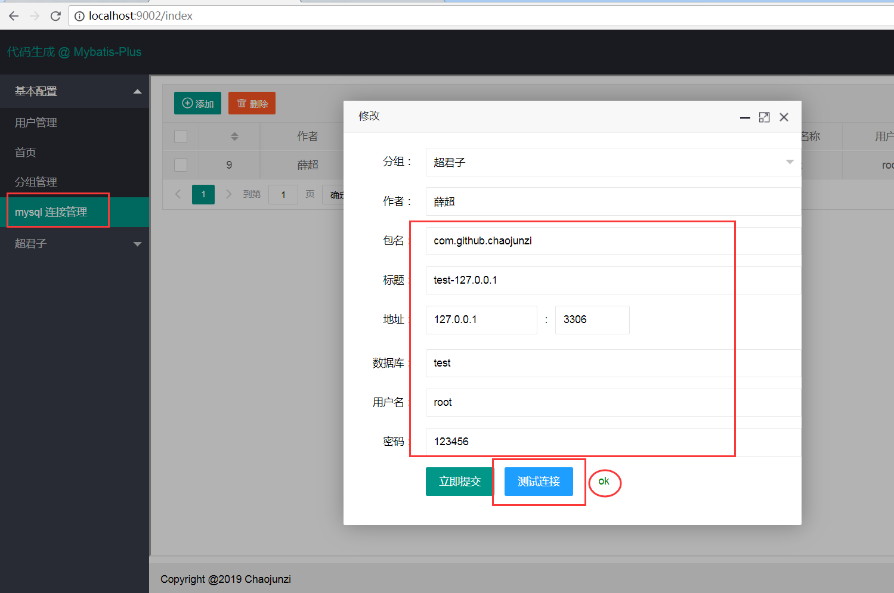
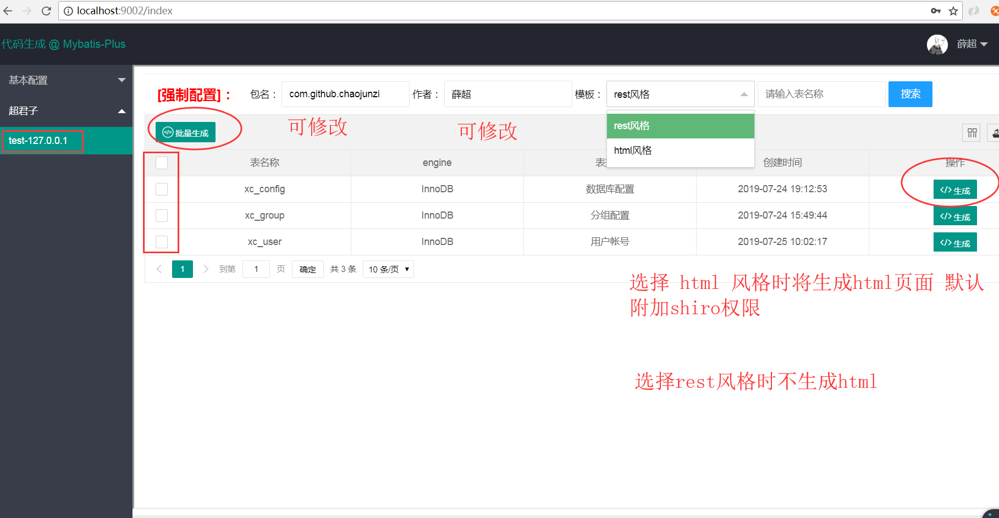

<p align="center">
  <a href="https://github.com/996icu/996.ICU/blob/master/LICENSE">
    
  </a>

  <a href="https://www.apache.org/licenses/LICENSE-2.0">
    
  </a>
</p>

## chao-cloud-generator
springboot+layui+mybatis-plus 代码自动生成器

## 数据库配置
* host: 127.0.0.1
* port: 3306
* database: test
* username: root
* password: 123456
* 请自行修改 bootstrap.yaml

## mysql 设计规范
##### [java@阿里云开发手册](https://developer.aliyun.com/guidebook/java?spm=5176.11065253.1996646101.searchclickresult.3dc76312f1d1Sd)
* 表名必须包含前缀
    - 例: xc_user
* 所有英文全部小写命名，用下划线分割（数据库名，表名，字段名）
* 数据库名，表名，禁止使用复数名词
* 单词首字母禁止数字开头
    - 正确: xc_area1 
    - 错误: xc_1area 
* 索引规范
    - 主键: pk_字段名
    - 唯一: uk_字段名 
    - 普通: idx_字段名
* 小数类型为 decimal 禁止使用float double
* 表必备字段  id,version,create_time
* 表的命名最好加上‘业务名称_表的作用’
* 库名和应用名称尽量保持一致
* 字段名称尽量简洁易懂，不要使用复数名词
    - 正确：status
    - 错误：user_status
    - 正确：type
    - 错误：types
* 字段名称不要使用中英文混合
* 减少使用关键字或保留字 [mysql@官方保留字](https://blog.csdn.net/m0_38047515/article/details/72877456)
* 见名识义

## 生成的目录结构 
##### [layui-风格为html 时生成](https://www.layui.com/doc/)
```java
	//1.java
	com.package			//可自定义（运行项目后有介绍）
		│
		├─controller   		//控制层
		│
		├─dal   		//持久层
		│  ├─entity 		//实体类
		│  └─mapper		//mapper映射和xml
		│
		└─service		//业务层
			└─impl		//实现类
			
	//2.html（目前只融合layui）
		templates
			└─prefix   			//表名的前缀
			  	└─model 		//模块名
			  	   ├─list.html		//列表（包含删除及批量删除）
			  	   ├─add.html		//增加
			  	   └─edit.html		//修改
```

## mysql 配置
```sql
# mysql连接
CREATE TABLE `xc_config` (
  `id` int(20) NOT NULL AUTO_INCREMENT,
  `group_id` int(11) DEFAULT NULL COMMENT '分组id',
  `author` varchar(255) DEFAULT '' COMMENT '作者',
  `package_name` varchar(255) DEFAULT '' COMMENT '包名',
  `title` varchar(30) DEFAULT '' COMMENT '标题',
  `host` varchar(255) DEFAULT '' COMMENT '主机',
  `port` int(11) DEFAULT 3306 COMMENT '端口',
  `database` varchar(255) DEFAULT '' COMMENT '数据库名称',
  `username` varchar(30) DEFAULT '' COMMENT '用户名',
  `password` varchar(100) DEFAULT NULL COMMENT '密码',
  `type` tinyint(4) DEFAULT 1 COMMENT '数据库类型 1.mysql',
  `version` int(11) DEFAULT 0 COMMENT '乐观锁',
  `create_time` datetime DEFAULT current_timestamp() COMMENT '创建日期',
  PRIMARY KEY (`id`)
) ENGINE=InnoDB AUTO_INCREMENT=10 DEFAULT CHARSET=utf8 COMMENT='数据库配置';
#分组管理
CREATE TABLE `xc_group` (
  `id` int(20) NOT NULL AUTO_INCREMENT,
  `name` varchar(30) DEFAULT '' COMMENT '分组名称',
  `version` int(11) DEFAULT 0 COMMENT '乐观锁',
  `create_time` datetime DEFAULT current_timestamp() COMMENT '创建日期',
  PRIMARY KEY (`id`)
) ENGINE=InnoDB AUTO_INCREMENT=7 DEFAULT CHARSET=utf8 COMMENT='分组配置';
#登录用户
CREATE TABLE `xc_user` (
  `id` int(20) NOT NULL AUTO_INCREMENT,
  `user_name` varchar(30) DEFAULT '' COMMENT '用户名',
  `password` varchar(100) DEFAULT NULL COMMENT '密码',
  `nick_name` varchar(30) DEFAULT '' COMMENT '昵称',
  `head_img` varchar(150) DEFAULT '' COMMENT '头像',
  `status` int(11) DEFAULT 1 COMMENT '状态 0.冻结 1.正常',
  `deleted` tinyint(4) DEFAULT 0 COMMENT '是否删除（0未删除1已删除）',
  `version` int(11) DEFAULT 0 COMMENT '乐观锁',
  `create_time` datetime DEFAULT current_timestamp() COMMENT '创建日期',
  PRIMARY KEY (`id`)
) ENGINE=InnoDB AUTO_INCREMENT=6 DEFAULT CHARSET=utf8 COMMENT='用户帐号';	
```

## 效果图展示

 
 

## 版权

### Apache License Version 2.0  

- 如不特殊注明，所有模块都以此协议授权使用。
- 任何使用了chao-cloud-generator的全部或部分功能的项目、产品或文章等形式的成果必须显式注明chao-cloud-generator。

### NPL (The 996 Prohibited License)

- 不允许 996 工作制度企业使用该开源软件

### 鸣谢
- [hutool-超级工具类](https://github.com/looly/hutool)  
- [lombok](https://github.com/rzwitserloot/lombok)  
- [mybatis-plus](https://github.com/baomidou/mybatis-plus)  
- [layui](https://github.com/sentsin/layui/)  
- [......](https://github.com/)  

感谢诸位用户的关注和使用，chao-cloud-generator并不完善，未来还恳求各位开源爱好者多多关照，提出宝贵意见。

作者 [@chaojunzi 1521515935@qq.com]

2019年8月19日